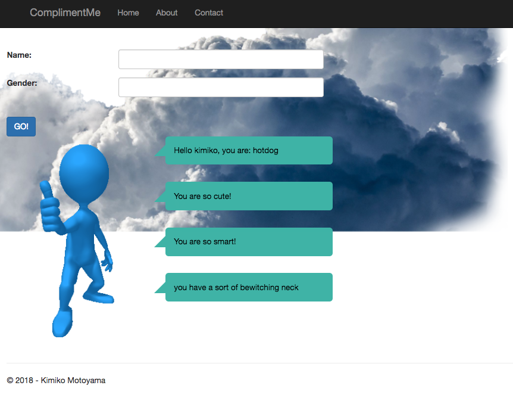

# 
<h1 align="center">
	<div
		width="300"
		alt="ComplimentMe">
    ComplimentMe
  </div>
</h1>

<h3 align="center">
	App to give you the compliment you deserve
</h3>

<h5 align="center">This project was created as a project while I was a student at Code Chrysalis.</h5>

<p align="center">
	
</p>

## Overview

* **Complimenting feature** Enter your name and gender, and it will give you an honest compliment that you deserve.
* **Cross-platform** Runs on Windows, macOS and Linux operating systems.
* **Animation** Animation of the clouds to always remind you that the sky is the limit.

## Installation and usage

* This requires [.NET Core SDK 2.1](https://www.microsoft.com/net/download)

### Running from source

The following commands install and run the development version:

```sh
git clone https://github.com/kimikomotoyama/polyglot_project.git
```

Then, go into your compiler to run the code.

⚠️ Run at your own risk!!!

### Technology used

* [ASP.NET Core 2.1](https://docs.microsoft.com/en-us/aspnet/index?view=aspnetcore-2.1#pivot=core) (language: C#) A lean and composable framework for building web and cloud applications. 
* [Complimentr](https://complimentr.com/) API to give you random compliments.
* [Animista](http://animista.net) Animista is a place where you can play with a collection of ready to use CSS animations, tweak them and download only those you will actually use.
* [Newtonsoft](https://www.newtonsoft.com/json) Popular high-performance JSON framework for .NET
